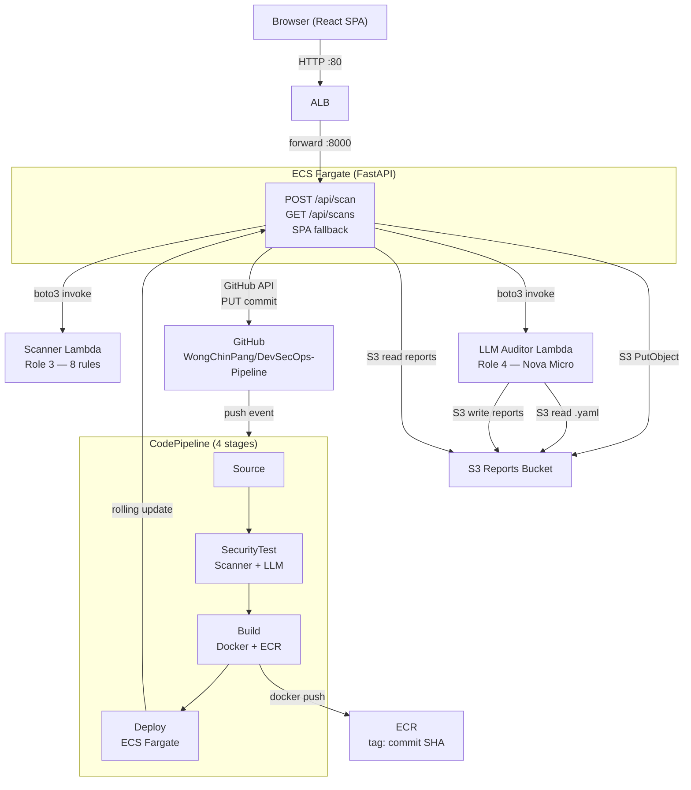
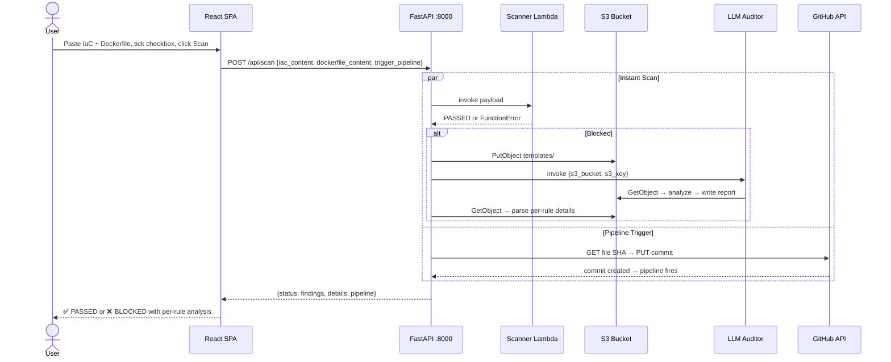
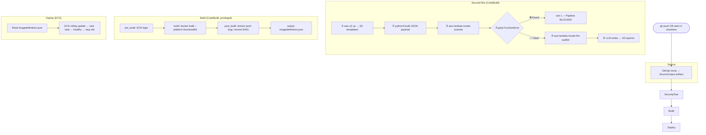

# DevSecOps Pipeline

Automated security scanning platform for IaC templates and Dockerfiles. Combines static rule-based detection with LLM-powered auditing, triggered through a CI/CD pipeline or directly from the web UI.

## 运行时架构

### Full System Architecture



### Scan Request Flow



### Pipeline Stage Details



## Quick Start

Open the web platform, paste IaC YAML + Dockerfile, and click **Run Security Scan**.

Tick the checkbox to also commit to GitHub and trigger the full CI/CD pipeline.

## API

| Endpoint | Method | Description |
|----------|--------|-------------|
| `/api/health` | GET | Health check |
| `/api/scan` | POST | Scan IaC + Dockerfile (`{iac_content, dockerfile_content, trigger_pipeline}`) |
| `/api/scans` | GET | Scan history |

## Security Checklist

| Category | Rule | Risk | Check |
|----------|------|------|-------|
| IAM | IAM-01 | HIGH | No `Action: '*'` wildcards |
| IAM | IAM-02 | HIGH | No `Resource: '*'` wildcards |
| Network | NET-01 | CRITICAL | No `0.0.0.0/0:22` (SSH) |
| Network | NET-02 | CRITICAL | No `0.0.0.0/0:5432` (PostgreSQL) |
| Network | NET-03 | CRITICAL | No `0.0.0.0/0:3306` (MySQL) |
| Data | DATA-01 | MEDIUM | S3 bucket encryption enabled |
| Data | DATA-02 | LOW | S3 uses KMS encryption |
| Container | CONT-01 | HIGH | Dockerfile uses non-root user |

## Pipeline

CodePipeline runs on every push to `main` and on web UI trigger:

1. **Source** — GitHub clone
2. **SecurityTest** — Upload IaC to S3 → static scan → LLM audit (blocks on failure)
3. **Build** — Docker build (`linux/amd64`) → push to ECR with commit SHA tag
4. **Deploy** — ECS rolling update behind ALB

## Project Structure

```
├── app/                    # FastAPI backend
│   ├── main.py             # API endpoints + SPA fallback
│   ├── scan_service.py     # Lambda invocation + result parsing
│   └── github_service.py   # GitHub Contents API integration
├── frontend/               # React + TypeScript + Tailwind SPA
│   └── src/components/     # UploadForm, ScanResults, ScanHistory
├── Dockerfile              # Multi-stage: Node build + Python serve
├── infrastructure.yaml     # CloudFormation IaC template
├── infrastructure-safe.yaml # Compliant version (Fn::Ref, KMS)
├── tests/                  # Safe/unsafe test cases
├── demo-block.sh           # Demo: push unsafe IaC → pipeline blocks
├── demo-pass.sh            # Demo: push safe IaC → pipeline passes
├── demo-push.sh            # Demo: simple trigger push
├── CONTEXT.md              # Domain model glossary
└── docs/agents/            # Agent skills configuration
```
