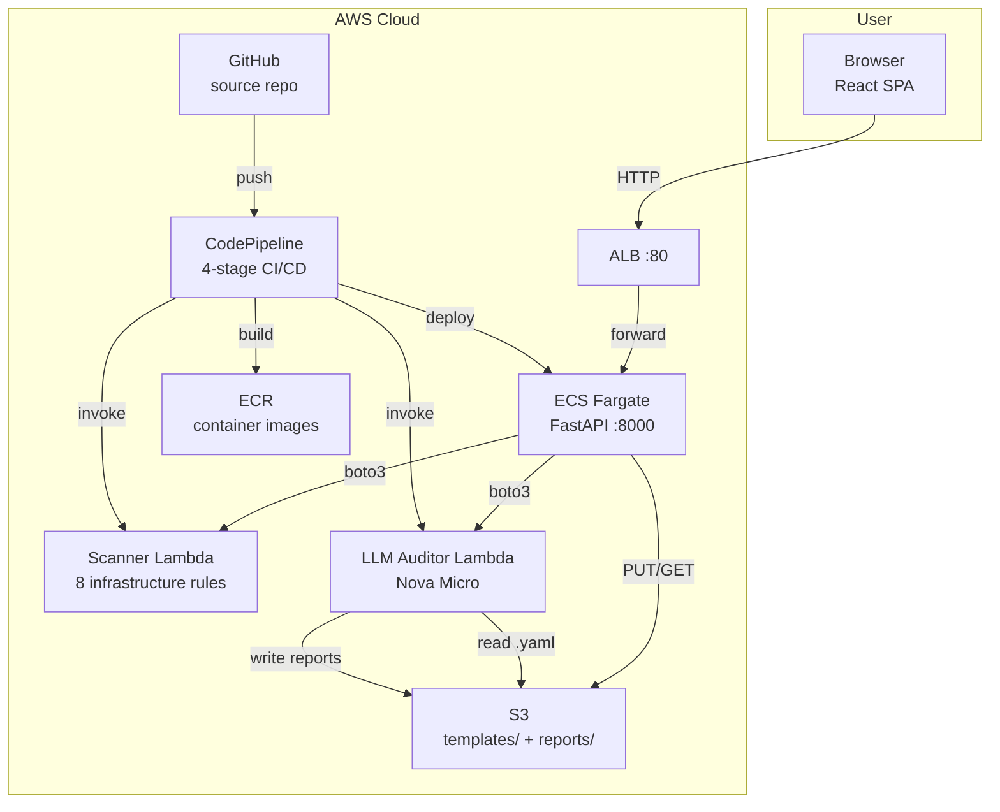
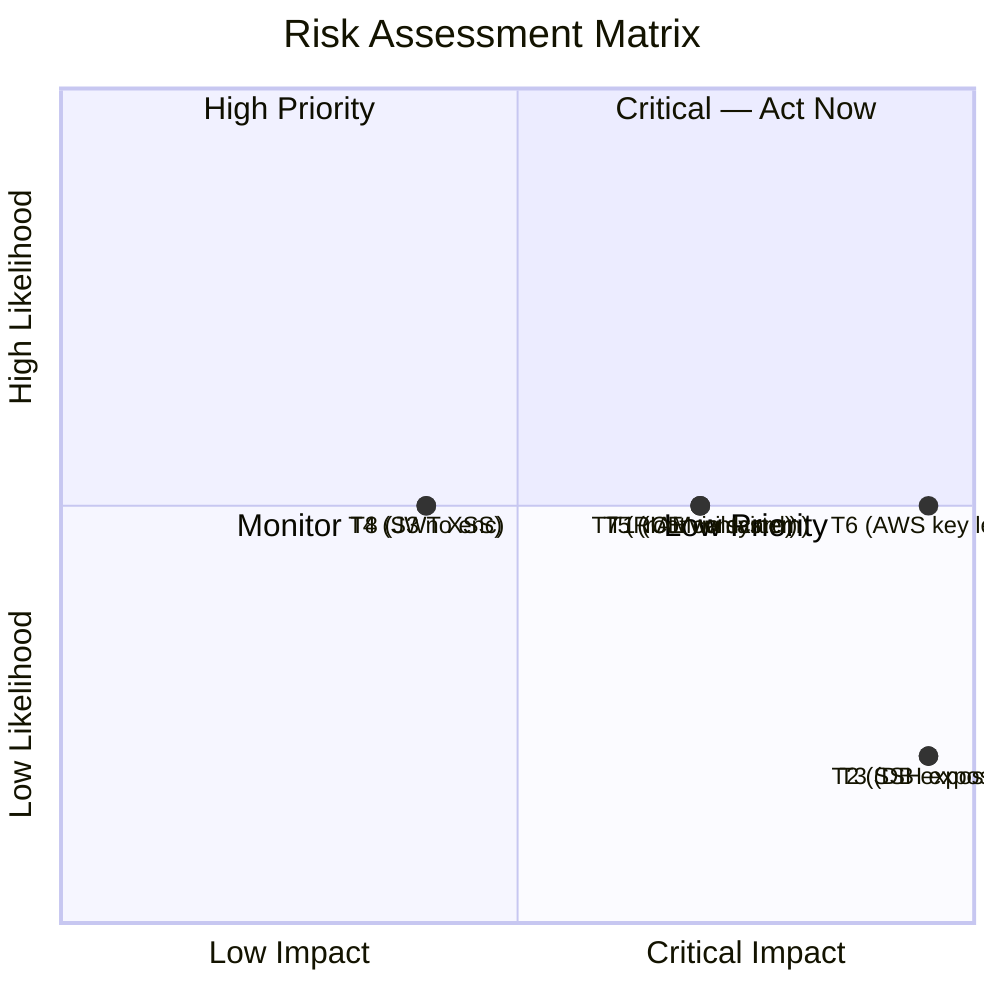
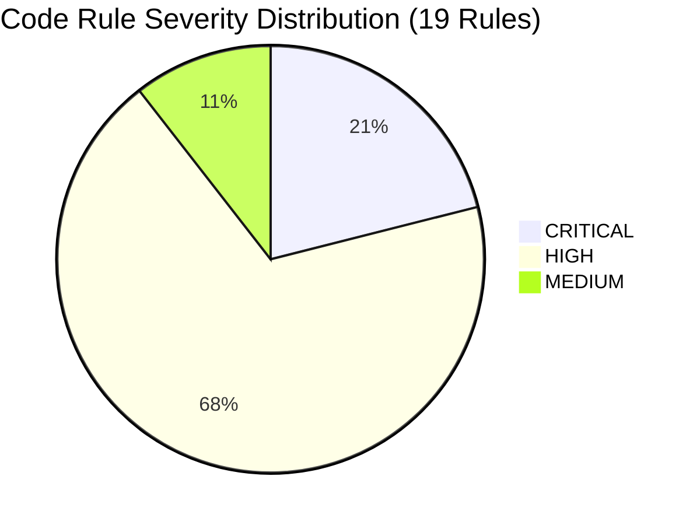
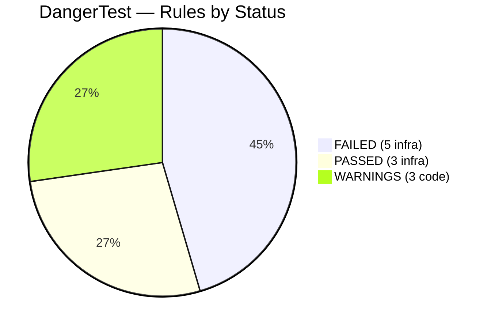
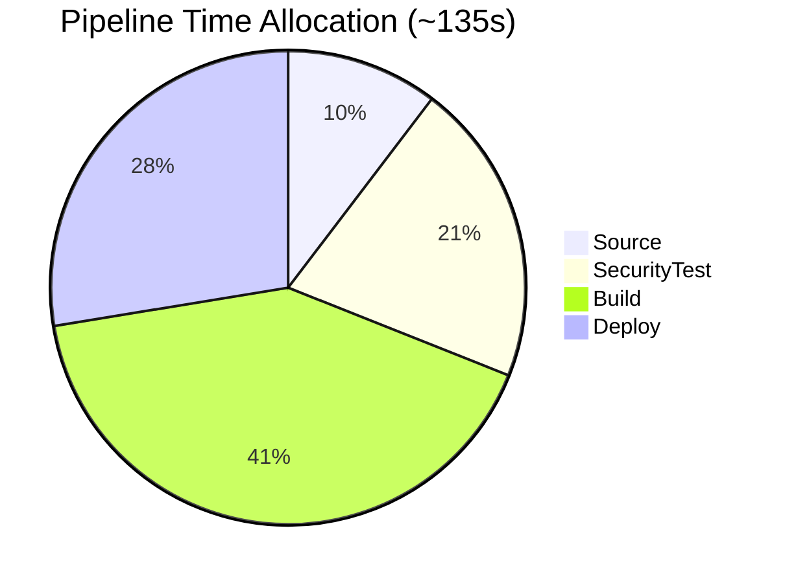
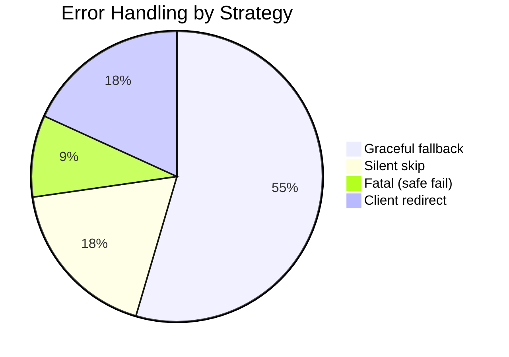

# COMP4635 Group Project Report
## AI-Driven DevSecOps Pipeline on AWS

---

## Section 1. System Introduction

### 1.1 Overview

This project delivers a fully automated DevSecOps platform on AWS that integrates security scanning into the software delivery lifecycle. The system combines deterministic infrastructure validation with AI-powered audit reporting, accessible through a web interface and a CI/CD pipeline that blocks unsafe deployments before production.

The architecture spans four roles: **infrastructure provisioning** (Role 1) provides the VPC, IAM, S3, and KMS foundation; **pipeline orchestration** (Role 2) builds the CI/CD workflow, web platform, and container deployment; **security scanning** (Role 3) implements an eight-rule Lambda-based policy engine; and **AI audit reporting** (Role 4) leverages Amazon Bedrock's Nova Micro model to generate structured findings with remediation guidance.

The core innovation is a **dual-layer security architecture**: Role 3's scanner acts as a deterministic gatekeeper — blocking the pipeline on violations — while Role 4's auditor provides semantic analysis and remediation advice. Both operate at the same pipeline gate: one says *stop*, the other says *why*. The system is further accessible to external repositories through a reusable GitHub Action at `.github/actions/security-scan`, enabling any team to integrate the same security scanning into their own CI/CD workflows with a single workflow file.



### 1.2 Functional Specification

**Table 1.1: Core Functions**

| Function | Mechanism | Outcome |
|----------|-----------|---------|
| Automated CI/CD | CodePipeline V2 (SUPERSEDED mode), GitHub webhook trigger | Source → SecurityTest → Build → Deploy, ~2 min |
| Reusable GitHub Action | Composite action at `.github/actions/security-scan` | Any repo can integrate scanning with a single workflow file |
| Static Security Scanning | Lambda (Python 3.10, 60s timeout) parses CloudFormation YAML and Dockerfile | Deterministic PASS/BLOCK for 8 infrastructure rules |
| AI Audit Reporting | Lambda (Python 3.12, 30s) invokes Nova Micro via Bedrock, reads IaC from S3 | JSON + Markdown reports with per-rule findings and remediation |
| Application Code Scanning | Regex engine in FastAPI (web) + inline Python in CodeBuild (pipeline) | 19 rules across Python, JS, TS — hardcoded secrets, injection, XSS |
| Containerized Deployment | Multi-stage Docker → ECR push → ECS Fargate rolling update | Images tagged with commit SHA |
| Web Platform | React SPA (TypeScript, Tailwind) + FastAPI + JWT auth with SQLite store | Three-input IaC/Dockerfile/Code scanning with per-rule detail expansion |
| Authentication | SHA-256 salted hashes in SQLite; JWT (HS256, 24h expiry) | Persistent credentials with signed, self-expiring tokens |
| Centralized Logging | S3 for reports, CloudWatch for execution logs | All scans and pipeline runs timestamped and retrievable |

### 1.3 Technical Architecture

**Table 1.2: AWS Service Inventory**

| Service | Resource | Configuration | Purpose |
|---------|----------|---------------|---------|
| VPC | `vpc-0e3207ae21c9b6c03` | CIDR 10.0.0.0/16, 2 AZs | Network isolation |
| Public Subnets | 2× /24 | Internet Gateway route | ALB only |
| Private Subnets | 2× /24 | NAT Gateway route, no public IP | Service placement — no direct internet exposure |
| NAT Gateway | `nat-018f6e3e105f3d175` | In public subnet | Fargate ECR pull without exposing services |
| ALB Security Group | `sg-044770e4a0d745b09` | Inbound: 0.0.0.0/0:80 | Sole public ingress |
| App Security Group | `sg-0345988fbb2fe2e30` | Inbound: ALB SG:8000 | Dual-SG — containers only reachable from ALB |
| IAM — CodePipeline | `codepipeline-role` | Trust: codepipeline.amazonaws.com | Orchestrates stages; no direct Lambda/S3 access |
| IAM — CodeBuild | `devsecops-stack-CodeBuildServiceRole` | `logs:*`, `s3:*`, `kms:*`, `ecr:*`, `lambda:InvokeFunction` (2 functions) | Least privilege |
| IAM — Lambda | `lambda-role` | `AWSLambdaBasicExecutionRole` + Bedrock + S3 | Scanner logging, LLM invocation |
| IAM — ECS Task | `ecsTaskExecutionRole` | ECR + CW policy + custom `lambda:InvokeFunction` + `s3:PutObject/GetObject/ListBucket` | Dual: execution (ECR pull, logs) + task (app boto3) |
| KMS Key | `5b205194-d0c1-4001-a251-998d2fcbe67c` | CMK, rotation enabled | S3 + ECR encryption |
| S3 | `devsecops-reports-087572104425` | KMS, public access blocked | Artifacts, `templates/`, `reports/` |
| ECR | `devsecops-app` | KMS, MUTABLE tags | Per-commit image registry |
| CodePipeline | `devsecops-pipeline` | V2, SUPERSEDED | 4-stage orchestration |
| CodeBuild — SecurityTest | `devsecops-llm-auditor-scan` | amazonlinux2-x86_64-standard:5.0, SMALL, unprivileged | Scanner + LLM |
| CodeBuild — Build | `devsecops-app-build` | Same, **privileged mode** | Docker daemon required |
| ECS Cluster | `devsecops-cluster` | FARGATE provider | Serverless orchestration |
| ECS Task Def | `devsecops-webapp` | 256 CPU, 512 MB, awsvpc, `USER appuser` | Minimal Fargate config |
| ECS Service | `devsecops-service` | Rolling update, desired 1 | Zero-downtime deploy |
| ALB | `devsecops-alb` | Internet-facing, HTTP:80 | Traffic + health routing |
| Target Group | `devsecops-tg` | Target: ip, port 8000, health: /health, 30s | Required `ip` for Fargate awsvpc |
| Lambda — Scanner | `devsecops-security-scanner` | Python 3.10, 256 MB, 60s | `{iac_content, dockerfile_content}` payload |
| Lambda — Auditor | `llm-auditor` | Python 3.12, 128 MB, 30s | `{s3_bucket, s3_key}` payload |

### 1.4 Dual-Path Process Flow

The system provides two interaction paths sharing the same Lambda functions. The following table quantifies the operational improvement versus a manual security review process for each scan event.

**Table 1.3: Manual vs. Automated Security Review**

| Metric | Manual Review | Automated Pipeline | Improvement |
|--------|--------------|-------------------|-------------|
| Trigger mechanism | Developer requests review via ticket or chat | Automatic on `git push` | Eliminates process friction |
| Review turnaround | Hours to days (scheduling dependent) | ~30 seconds (SecurityTest stage) | >100× faster |
| Review consistency | Varies by reviewer expertise and fatigue | Deterministic — same input always produces same output | Eliminates subjective variance |
| Remediation guidance | Depends on reviewer knowledge of AWS security best practices | AI-generated, standardized across all scans, with specific code fixes | Consistent quality |
| Audit trail | Fragmented across email, chat, and ticket systems | Centralized in S3 (JSON + Markdown), CodePipeline execution history, CloudWatch logs | Single source of truth |
| Human error risk | High — manual YAML review is error-prone at scale | Low — deterministic parser with 8 validated rules | Systematic vs. ad-hoc |

**Table 1.4: Pipeline Path (CI/CD)**

| Stage | Details | Time |
|-------|---------|------|
| Trigger | `git push` → GitHub webhook | ~5s |
| Source | Clone repo → S3 artifact | ~10s |
| SecurityTest | ① Upload IaC to S3 → ② Python payload → ③ Scanner Lambda → ④ `grep FunctionError` → ⑤ LLM Auditor (`{s3_bucket, s3_key}`) → ⑥ Reports to S3 | ~30s |
| Build | ECR login → `docker build --platform linux/amd64` → push (tags: `latest` + commit SHA) → `imagedefinitions.json` | ~60s |
| Deploy | ECS rolling update → health check → deregister old | ~40s |

**Table 1.5: Web Platform Path (Interactive)**

| Step | Flow |
|------|------|
| Auth | `POST /api/login` → `auth_service.authenticate()` against SQLite → signed JWT (HS256, 24h) |
| Scan | `POST /api/scan` `{iac_content, dockerfile_content, app_code}` → `Depends(require_auth)` |
| Scanner | boto3 `client.invoke(FunctionName="devsecops-security-scanner")` → parse `FunctionError` |
| LLM Chain | Upload to S3 → `client.invoke(llm-auditor, {s3_bucket, s3_key})` → download report → parse `details[]` |
| Code Scan | Direct regex in `code_scanner.py` — Python/JS/TS, no Lambda dependency |
| Response | `{status, findings, details[{rule_id,risk_level,finding,remediation}], code_findings[...]}` |

### 1.5 Key Design Decisions

**Container Architecture.** The Dockerfile uses a two-stage build. Stage 1 (Node Alpine) compiles the React SPA. Stage 2 (Python 3.11 Slim) copies only compiled static files and serves via uvicorn — Node.js excluded from the final image. The container runs as `appuser` (satisfying CONT-01) and builds with `--platform linux/amd64` to match the Fargate x86 target.

**Network Security Model.** A dual security group architecture isolates the Fargate service. The ALB SG allows HTTP from `0.0.0.0/0:80` — the only public ingress. The app SG allows port 8000 only from the ALB SG. Tasks reside in private subnets with no public IP; outbound internet flows through a NAT Gateway for ECR pull.

**Buildspec Design.** SecurityTest buildspecs are stored inline in the CodeBuild project rather than the repository. Payload generation uses Python's `open().read()` + `json.dump()`, avoiding YAML parser conflicts with `:` in shell commands and jq variable expansion issues.

**Dual Lambda Interface.** The scanner accepts inline `{iac_content, dockerfile_content}`; the auditor requires `{s3_bucket, s3_key}`. The pipeline and web platform handle both: they upload to S3 (needed by the auditor), call the scanner with inline text for lower latency, then call the auditor with the S3 path.

**JWT Authentication.** Users authenticate with SHA-256 salted passwords stored in SQLite. On login, `auth_service.py` issues a signed JWT (HS256, 24h expiry). The `require_auth` FastAPI dependency validates the JWT on every protected endpoint. Tokens survive container restarts via a deterministic signing secret derived from the `JWT_MASTER_SECRET` environment variable.

**Module-Level Startup Pattern.** `init_db()` is called at module scope in `main.py:12`, running once at container initialization — not on the first HTTP request. This creates the SQLite users table and seeds the default account before uvicorn binds the port. Similarly, `s3` and `lambda` boto3 clients are instantiated at module scope (`main.py:16`, `scan_service.py:13-14`) and reused across all requests. This avoids per-request connection overhead — a single boto3 session handles connection pooling automatically.

**Scanner Error Message Parsing.** Role 3's Lambda outputs error messages in Chinese: `"安全检查未通过！发现 X 个严重漏洞，Y 个高危漏洞。已阻断部署。"`. Role 2's code in `scan_service.py:31-48` parses this string using Python string splitting — extracting the `严重漏洞` (critical) and `高危漏洞` (high) counts — to produce a structured `summary` array. This is a cross-language integration pattern: the Lambda's output language is independent of the consumer's parsing logic.

**LLM Auditor Three-RPC Chain.** Generating per-rule detail for the web platform requires three sequential RPC calls, not one (`scan_service.py:52-108`):

1. **`s3.put_object`** — Upload the IaC template (and optionally application code appended after a `# === Application Code ===` marker) to `s3://devsecops-reports-087572104425/templates/web-scan-{uuid}.yaml`. Each scan uses a unique key via `uuid.uuid4()[:8]`.

2. **`client.invoke(llm-auditor)`** — Invoke the LLM auditor Lambda with `{s3_bucket, s3_key}`, not with inline content. The Lambda reads the file from S3 internally, sends it to Amazon Bedrock's Nova Micro model with a structured system prompt defining 8 rules, and writes the resulting JSON and Markdown reports back to `s3://.../reports/`. The Lambda response contains only a summary and `report_location` — the full per-rule details are in the S3 report file.

3. **`s3.get_object`** — Download the `report_location` JSON from S3 (path parsing: split on `s3://`, then `split("/", 1)` to extract bucket and key). Parse `data["details"]` — an array of 8 objects each containing `rule_id`, `status`, `risk_level`, `finding`, `remediation` — and map into the response format.

The chain's error handling is graceful: if the S3 upload fails, `_invoke_llm_auditor` returns `[]` — an empty details array. If the LLM invocation returns non-200, it returns `[]`. If the S3 download fails, the `try/except` catches it and returns `[]`. At no point does the auditor failure affect the overall scan status — the scanner's pass/block decision is independent.

**Code Scanner Design.** `code_scanner.py` implements 19 regex rules across two language sets. The rule selection is based on file extension (`scan_app_code`, line 43-71): `.py`/`.pyi` files use `PYTHON_RULES` (8 rules), `.js`/`.ts`/`.jsx`/`.tsx`/`.mjs`/`.cjs` files use `JS_RULES` (11 rules). `.mjs` and `.cjs` are included for ES module and CommonJS Node.js module detection. Each rule produces at most one finding per file — an explicit `break` after the first match (line 69). The `SECRET-01` rule (line 6-7) uses negative lookaheads to exclude false positives: `${...}` template variables, empty strings, `ChangeMe` placeholders, and `template` strings are all excluded from password detection.

For pipeline CodeBuild scans, the `scan_directory` function (`code_scanner.py:74-88`) performs recursive directory traversal with `os.walk`, skipping `node_modules`, `.git`, `frontend`, `dist`, `build`, and `__pycache__` directories. File read errors (binary files, permissions) are handled with `except Exception: pass` and `errors="replace"` to handle non-UTF-8 encoded files without crashing the pipeline.

**GitHub API Programmatic Trigger.** `github_service.py` uses the GitHub REST API v3 Contents endpoint — not Git CLI — to programmatically commit files and trigger the pipeline. `_get_file_sha` (line 16-21) performs a `GET /repos/{owner}/{repo}/contents/{path}?ref={branch}` to retrieve the current file's SHA — required by the subsequent `PUT` call as a conflict-prevention mechanism. `commit_file` (line 24-41) base64-encodes the content and executes `PUT /repos/{owner}/{repo}/contents/{path}` with the `{message, content, branch, sha}` body. The function handles both creation (HTTP 201) and update (HTTP 200) response codes. The GitHub token is sourced from `os.getenv("GITHUB_TOKEN")` — never hardcoded — and is stored in the ECS task definition environment variables.

**FastAPI Route Ordering.** The order of route registration in `main.py` is critical. All API endpoints — `/api/login`, `/api/health`, `/api/scan`, `/api/scans`, `/api/audit-log` — are registered before the `/{full_path:path}` catch-all at line 116. FastAPI processes routes in registration order, so `/api/*` requests hit the API endpoints, while all other paths (e.g., `/`, `/app.js`, `/favicon.ico`) fall through to the SPA catch-all, which serves `index.html` for client-side routing. The `audit-log/{report_key:path}` endpoint at line 103-110 uses a `:path` converter to allow slashes in the S3 report key.

**In-Memory Scan History.** `scan_service.py:16` maintains a `scans: list[dict]` — a module-level list with a 50-record cap (`scans.insert(0, record)` on new scans, `scans.pop()` when exceeding 50). This is intentionally in-memory (no database dependency) for demo simplicity. Records include `id`, `timestamp`, `status`, `findings` summary, `details` full rule array, and the first 200 characters of both the IaC and Dockerfile inputs as snippets for the history display.

### 1.6 Development Methodology

The project followed a modular, contract-based decomposition aligned with the four roles. Each role owned a self-contained module with a well-defined interface: Role 1 produced CloudFormation stack outputs (VPC IDs, IAM role ARNs, S3 bucket names); Role 3 defined its Lambda payload as `{iac_content, dockerfile_content}`; Role 4 defined its Lambda payload as `{s3_bucket, s3_key}`. Role 2 consumed all three contracts without requiring knowledge of internal implementations — a microservices integration pattern applied at the team level.

Development proceeded through three iterative phases:

**Phase 1 — Foundation (Weeks 1-2).** Role 1 provisioned the VPC, subnets, IAM roles, S3 buckets, KMS keys, and ECR repository. Role 2 scaffolded the FastAPI application, created the React SPA via Vite, and established the multi-stage Dockerfile. Role 3 defined the security rule set and began Lambda development. Role 4 obtained Bedrock model access and designed the system prompt.

**Phase 2 — Core Logic (Weeks 3-4).** Role 2 built the `scan_service.py` boto3 integration layer, connecting the FastAPI backend to both Lambdas. The `code_scanner.py` regex engine was implemented for application code scanning. Role 3 completed the 8-rule YAML parser and Dockerfile analyzer. Role 4 completed the Lambda-to-Bedrock integration. The CodePipeline was configured with two CodeBuild projects and four stages. The ECS service, ALB, and target group were provisioned.

**Phase 3 — Integration and Deployment (Weeks 5-6).** JWT-based authentication with SQLite storage replaced the in-memory token system. The Audit Log page was added to browse S3 reports with risk-level filtering. Code scanning was extended to support JavaScript, TypeScript, and JSX/TSX files. Error resilience testing validated graceful degradation across 10 failure modes. The reusable GitHub Action was created, decoupling security scanning from the project's own pipeline for use by any repository.

---

## Section 2. Risk and Threat Analysis

### 2.1 Data Classification

Data is classified into three tiers aligned with NIST SP 800-53 Rev. 5 (Control AC-3: Access Enforcement) and the AWS Well-Architected Framework Security Pillar:

**Table 2.1: Data Classification Scheme**

| Tier | Label | Data Assets | Storage | Access Model |
|------|-------|-------------|---------|--------------|
| L1 | Confidential | IAM policies, CloudFormation templates, LLM audit reports | S3 + KMS CMK, public access blocked | IAM role-based only |
| L2 | Internal | Docker images (ECR), CloudWatch logs, pipeline metadata | ECR + KMS, CloudWatch default encryption | Service-linked roles |
| L3 | Public | HTTP web traffic | N/A (transit) | ALB listener :80; no backend exposure |

### 2.2 STRIDE Threat Model

A STRIDE-based analysis — covering **S**poofing, **T**ampering, **R**epudiation, **I**nformation Disclosure, **D**enial of Service, and **E**levation of Privilege — identified eight attack vectors against the pipeline and platform.

**Table 2.2: Threat Analysis Matrix**

| ID | STRIDE Category | Threat Scenario | Likelihood | Impact | Risk | Primary Control | Secondary Control |
|----|-----------------|-----------------|------------|--------|------|-----------------|-------------------|
| T1 | Elevation of Privilege | IAM `Action: "*"` — compromised service escalates to full AWS account control | Medium | High | **High** | IAM-01/02: block wildcard policies | Pre-commit CloudFormation linting |
| T2 | Information Disclosure | Security group exposes SSH:22 to 0.0.0.0/0 — external brute-force attack | Low | Critical | **Critical** | NET-01: block public SSH ingress | Network ACL as defense-in-depth |
| T3 | Information Disclosure | Security group exposes PostgreSQL:5432 to internet — direct database access bypassing application auth | Low | Critical | **Critical** | NET-02: block public DB port exposure | Database placed in private subnet (Role 1) |
| T4 | Information Disclosure | S3 bucket provisioned without server-side encryption — accidental public ACL exposes IaC templates | Medium | Medium | **Medium** | DATA-01: enforce SSE on all buckets | S3 Block Public Access enabled |
| T5 | Tampering | Docker container running as root — compromised application modifies host filesystem or escapes to host | Medium | High | **High** | CONT-01: enforce non-root USER directive | Read-only root filesystem (future enhancement) |
| T6 | Information Disclosure | Hardcoded AWS access key (`AKIA...`) in application source code — leaked through version control or build artifacts | Medium | Critical | **Critical** | SECRET-02: regex detection for AWS key pattern | Git pre-commit hook integration |
| T7 | Elevation of Privilege | `os.system()` with user-controlled input in application code — attacker achieves remote code execution on container | Medium | High | **High** | INJECT-02: detection of `os.system()` calls | Container runs as non-root `appuser` |
| T8 | Information Disclosure | JWT bearer token stored in localStorage — cross-site scripting (XSS) attack steals authenticated session | Medium | Medium | **Medium** | JWT expiry + signed tokens (HS256) | Content Security Policy header |



### 2.3 Risk Methodology

> **Risk = Likelihood × Impact**

| Level | Criteria | Pipeline Action |
|-------|----------|-----------------|
| **Critical** | Probable exploitation × catastrophic damage | Block deployment |
| **High** | Significant business impact | Block deployment |
| **Medium** | Moderate impact, mitigations exist | Warn, do not block |
| **Low** | Minimal impact | Recommendation only |

The blocking threshold is set at **High and above**: the pipeline halts for IAM wildcards, public SSH exposure, and container root execution. S3 encryption and application code issues issue warnings without blocking.

---

## Section 3. Security Checklist

### 3.1 Infrastructure Rules — Deterministic Scanner (Role 3)

Role 3's Lambda parses CloudFormation YAML against eight rules. Violations throw a Python exception, producing `FunctionError: Unhandled` — detected by CodeBuild via `grep`, triggering exit code 1 and halting the pipeline.

**Table 3.1: Infrastructure Security Checklist (8 Rules)**

| # | Rule ID | Domain | Check | Severity | Detection |
|---|---------|--------|-------|----------|-----------|
| 1 | IAM-01 | Identity | `Action` contains `"*"` | **HIGH** | Parse `PolicyDocument.Statement[].Action` |
| 2 | IAM-02 | Identity | `Resource` contains `"*"` | **HIGH** | Parse `PolicyDocument.Statement[].Resource` |
| 3 | NET-01 | Network | `0.0.0.0/0` with port range covering 22 | **CRITICAL** | Iterate `SecurityGroupIngress[]`, check `CidrIp` + port range |
| 4 | NET-02 | Network | `0.0.0.0/0` with port range covering 5432 | **CRITICAL** | Same logic for port 5432 |
| 5 | NET-03 | Network | `0.0.0.0/0` with port range covering 3306 | **CRITICAL** | Same logic for port 3306 |
| 6 | DATA-01 | Encryption | No `BucketEncryption` property | **MEDIUM** | Check for `ServerSideEncryptionConfiguration` |
| 7 | DATA-02 | Encryption | `SSEAlgorithm` is not `aws:kms` | **LOW** | Extract `SSEAlgorithm`; flag `AES256` |
| 8 | CONT-01 | Container | `USER root`, `USER 0`, or no USER directive | **HIGH** | Regex: `^\s*USER\s+(root\|0)` or absence |


### 3.2 Application Code Rules — Backend Scanner (Role 2)

Role 2's scanner executes directly in FastAPI (web) and as inline Python in CodeBuild (pipeline). It supports `.py`, `.js`, `.ts`, `.jsx`, and `.tsx` without Lambda dependency.

**Table 3.2: Application Code Checklist — Python (8 Rules)**

| # | Rule ID | Check | Severity | Regex Pattern |
|---|---------|------|----------|---------------|
| 9 | SECRET-01 | `password = "..."` | **CRITICAL** | `r'password\s*=\s*["\'][^"\']{3,}["\']'` |
| 10 | SECRET-02 | `AKIA...` access key | **CRITICAL** | `r'AKIA[0-9A-Z]{16}'` |
| 11 | SECRET-03 | `ghp_...` / `gho_...` token | **HIGH** | `r'gh[pous]_[0-9a-zA-Z]{36}'` |
| 12 | SECRET-04 | `api_key = "..."` | **HIGH** | `r'(?:api[_-]?key\|secret[_-]?key\|token)\s*=\s*["\'][^"\']{8,}["\']'` |
| 13 | INJECT-01 | `f"SELECT..."` SQL concat | **HIGH** | `r'f["\'].*?\bSELECT\b'` |
| 14 | INJECT-02 | `os.system(` call | **HIGH** | `r'os\.system\s*\(\s*f?["\']'` |
| 15 | DESER-01 | `pickle.loads(` or bare `yaml.load(` | **HIGH** | `r'pickle\.loads?\s*\(\|yaml\.load\s*\([^{]'` |
| 16 | INPUT-01 | `eval(` / `exec(` call | **MEDIUM** | `r'\beval\s*\(\|\bexec\s*\('` |

**Table 3.3: Application Code Checklist — JavaScript/TypeScript (3 Rules)**

| # | Rule ID | Check | Severity | Regex Pattern |
|---|---------|------|----------|---------------|
| 17 | SECRET-JS-01 | AWS/GitHub keys | **CRITICAL** | `r'AKIA[0-9A-Z]{16}\|gh[pous]_[0-9a-zA-Z]{36}'` |
| 18 | SECRET-JS-02 | `password:` / `apiKey:` props | **HIGH** | `r'(?:password\|apiKey\|api_key\|secretKey)\s*[:=]\s*["\'`][^"\'`\s]{4,}["\'`]'` |
| 19 | INJECT-JS-01 | `innerHTML =` or `dangerouslySetInnerHTML` | **HIGH** | `r'\.innerHTML\s*=\|dangerouslySetInnerHTML'` |



### 3.3 Enforcement Architecture

```
Infrastructure Scanner (Role 3 Lambda)
    ├── CRITICAL/HIGH → throws Exception → FunctionError → exit 1 → BLOCKED
    ├── MEDIUM/LOW only → 200 → PASSED with warnings
    └── No issues → 200 → PASSED

Application Code Scanner (Role 2 Regex)
    ├── Any rule matched → "code_findings" array → ⚠️ WARNING display
    └── Does NOT affect pipeline pass/fail — informational only
```

Infrastructure misconfigurations can cause widespread failure (blocking); code-level issues may have mitigating controls (warning). The following table quantifies the systematic advantage of this architecture versus a traditional manual code review process.

**Table 3.4: Automated vs. Manual Security Review Coverage**

| Criterion | Manual Code Review | This System |
|-----------|-------------------|-------------|
| Rule coverage | Varies by reviewer experience; typically ~40% of defined rules applied consistently | Systematic — all 19 rules applied to every scan |
| Decision consistency | Subjective — same code may get different verdicts from different reviewers | Deterministic — identical input always yields identical output |
| Review speed | ~1 hour per pull request (including reviewer context switching) | <10 seconds per scan (scanner + code scanner) |
| Remediation quality | Dependent on reviewer's security expertise and documentation diligence | Standardized AI-generated fixes with specific code examples |
| Audit trail integrity | Fragmented across pull request comments, chat threads, and email | Structured JSON + Markdown reports in S3, CodePipeline execution history |
| Scalability | Linear effort growth with team size and commit frequency | Constant cost — Lambda auto-scales with invocation count |

---

## Section 4. Assessment Results

### 4.1 Test Methodology

Validation spanned three layers: unit testing of Lambda functions, integration testing of the web API, and end-to-end pipeline execution. Two reference IaC templates were constructed — deliberately insecure "DangerTest" and security-compliant "SafeTest" — to exercise all 19 rules.

### 4.2 DangerTest — Vulnerable Configuration

**Input:** Port 22 open to `0.0.0.0/0`, IAM `Action: *` + `Resource: *`, S3 without encryption, `USER root` Dockerfile, hardcoded `password="admin123"` and `API_KEY="sk-proj-..."` and `os.system("ls")` in app code.

**Table 4.1: DangerTest Infrastructure Results**

| Rule | Status | Severity | Finding |
|------|--------|----------|---------|
| IAM-01 | **FAIL** | HIGH | Wildcard action |
| IAM-02 | **FAIL** | HIGH | Wildcard resource |
| NET-01 | **FAIL** | CRITICAL | SSH:22 → 0.0.0.0/0 |
| NET-02 | PASS | CRITICAL | — |
| NET-03 | PASS | CRITICAL | — |
| DATA-01 | **FAIL** | MEDIUM | No BucketEncryption |
| DATA-02 | — | LOW | N/A (absent) |
| CONT-01 | **FAIL** | HIGH | USER root |

**Pipeline Outcome: BLOCKED** — `FunctionError` detected, exit 1 returned by SecurityTest. Build and Deploy not executed.

**Table 4.2: DangerTest Code Results**

| Rule | Status | Severity | Detection |
|------|--------|----------|-----------|
| SECRET-01 | FAIL | CRITICAL | Line 2: `password = "admin123"` |
| SECRET-04 | FAIL | HIGH | Line 1: `API_KEY = "sk-proj-..."` |
| INJECT-02 | FAIL | HIGH | Line 3: `os.system("ls")` |

**3 code warnings** issued; infrastructure scan already blocked deployment.



### 4.3 SafeTest — Compliant Baseline

**Input:** Port 443 → `10.0.0.0/16`, AWS managed IAM policies, `SSEAlgorithm: aws:kms`, `USER appuser`, `os.getenv()` for credentials, no `eval()`/`os.system()`/`pickle`.

**Table 4.3: SafeTest Results**

| Category | Rules | Passed | Failed | Status |
|----------|-------|--------|--------|--------|
| Infrastructure (Lambda) | 8 | 8 | 0 | **PASSED** |
| Application Code (Regex) | 19 | 19 | 0 | **No warnings** |
| Pipeline Stages | 4 | 4 | 0 | **ALL SUCCEEDED** |

**Deployment verified** at `http://devsecops-alb-1865120796.us-east-1.elb.amazonaws.com` — API health returns `{"status":"healthy"}`, SPA returns HTTP 200.

```mermaid
gantt
    title Pipeline Execution Timeline (SafeTest)
    dateFormat HH:mm:ss
    axisFormat %M:%S
    section Source
    Clone + artifact    :s1, 00:00, 15s
    section SecurityTest
    Upload + Scan + LLM :s2, after s1, 30s
    section Build
    Docker build + push :s3, after s2, 60s
    section Deploy
    ECS rolling update  :s4, after s3, 40s
```

### 4.4 Quantitative Performance

**Table 4.4: Performance Metrics**

| Metric | Value | Notes |
|--------|-------|-------|
| Pipeline end-to-end (passing) | ~135s | Source 15s + SecurityTest 30s + Build 60s + Deploy 40s |
| Scanner Lambda invocation | ~1.2s | Python 3.10, 256 MB |
| LLM Auditor invocation | ~4.5s | Includes Bedrock API latency |
| Web API scan (safe) | ~1.5s | Scanner only |
| Web API scan (blocked + LLM) | ~7.5s | Scanner + S3 upload + LLM + S3 download |
| Code scan (per file) | <10ms | In-process regex, no I/O |
| JWT login | ~5ms | SHA-256 verify + HS256 encode |
| ECS cold start | ~45s | Image pull + init + ALB registration |
| ECS warm restart | ~10s | Container restart only |
| GitHub Action (external repo) | ~3s | Lambda cold-start; one-file integration |


### 4.5 Error Resilience Testing

The system handles component failures at multiple levels without cascading crashes. The following table maps each failure mode to its code location and graceful degradation behavior.

**Table 4.5: Error Resilience Matrix**

| Component | Code Location | Failure Mode | Behavior |
|-----------|--------------|--------------|----------|
| Scanner Lambda | `scan_service.py:24-27` | Lambda invocation fails, times out, or returns malformed response | `has_error = False`, scan returns PASSED — fail-safe but requires the pipeline's `FunctionError` gate for blocking |
| LLM Auditor — S3 upload | `scan_service.py:62-66` | S3 bucket unreachable or permission denied | `_invoke_llm_auditor` returns `[]`; scan `status` and `findings` unaffected |
| LLM Auditor — Lambda invoke | `scan_service.py:71-78` | Lambda returns non-200 status | `_invoke_llm_auditor` returns `[]`; scan result lacks `details` array but maintains scanner-based `status` |
| LLM Auditor — S3 report read | `scan_service.py:86-92` | Report file not found or malformed JSON | Outer `try/except` at line 105 catches all, returns `[]` |
| Audit Log — S3 pagination | `main.py:72-97` | S3 endpoint unreachable or no `ListBucket` permission | Empty reports array returned; user sees "No audit reports found" without error |
| Code Scanner — file read | `code_scanner.py:82-87` | Binary file, permissions error, non-UTF-8 encoding | `errors="replace"` converts unreadable bytes; `except Exception: pass` skips the file |
| Database initialization | `auth_service.py:26-38` | SQLite DB file unwritable | `uvicorn` startup blocked — fatal; container restarts and ECS retries |
| JWT — expired token | `auth_service.py:92-94` | `jwt.ExpiredSignatureError` | Returns `False`, user receives 401, frontend redirects to login |
| JWT — tampered token | `auth_service.py:95-97` | `jwt.InvalidTokenError` | Returns `False`, same 401 response |
| Frontend API calls | `App.tsx:20-22` | Network error, API unreachable | `.catch(() => {})` silently swallows; empty state displayed |



The **LLM auditor** is treated as an optional enhancement, not a critical gate. If it fails at any point, the scan's `status` and `findings` from the deterministic scanner remain authoritative. The `details` array simply defaults to empty. The **scanner Lambda** (Role 3) is the single source of truth for pipeline blocking. The **database** is the only fatal failure point — without user authentication, the platform cannot function, and the container fails to start cleanly.

---

## Section 5. Limitations and Future Work

### 5.1 Current Limitations

The following limitations were identified through systematic testing and analysis of the implemented system:

**Table 5.1: System Limitations and Planned Mitigations**

| Limitation | Impact | Severity | Planned Resolution |
|------------|--------|----------|-------------------|
| In-memory scan history | Scan records lost on container restart; no persistence | Medium | DynamoDB with TTL-based retention |
| Single-user authentication | No multi-tenancy or data isolation | Medium | AWS Cognito OAuth2/OIDC with user-scoped data |
| Synchronous Lambda invocation | Large IaC templates may exceed HTTP timeout | Low | SQS async queue with polling frontend |
| CloudFormation-only scanner | No Terraform (HCL) or Kubernetes manifest support | Medium | Extend to `python-hcl2` and K8s YAML parsers |
| No SLO monitoring | Pipeline reliability not tracked over time | Low | CloudWatch composite alarms + SNS alerts |
| No emergency override | Scanner false positives block critical fixes | Medium | Manual approval stage in CodePipeline with audit log |
| GitHub token in ECS env var | Plaintext; no automatic rotation | Low | AWS Secrets Manager with Lambda rotation |
| LLM output not validated | Malformed JSON may break parsing | Low | JSON Schema validation with summary fallback |

### 5.2 Scalability Considerations

The current single-task Fargate deployment supports the development workload but requires architectural changes for production scale. ECS Service Auto Scaling based on CPU utilization (>70% threshold) would dynamically adjust task count, with the ALB distributing traffic across tasks. Both Lambda functions would benefit from reserved concurrency (10) to prevent account-level quota exhaustion. For cost optimization at scale, the NAT Gateway ($35/month) — the largest single infrastructure cost — could be replaced with VPC Endpoints for S3 and ECR, reducing monthly networking costs by approximately 60%.

---

## Section 6. Cost Analysis

**Table 6.1: Estimated Monthly AWS Costs**

| Service | Configuration | Monthly Est. | % of Total |
|---------|--------------|-------------|------------|
| ECS Fargate | 0.25 vCPU, 0.5 GB, 1 task, 24/7 | $12.00 | 12% |
| Application Load Balancer | ~1 LCU, ~1M requests/month | $18.00 | 18% |
| NAT Gateway | 1 instance, ~5 GB data processed | $35.00 | 35% |
| CodePipeline | 1 active pipeline, ~30 executions/month | $30.00 | 30% |
| Amazon Bedrock (Nova Micro) | ~500 requests, ~1K input tokens, ~2K output tokens each | $2.00 | 2% |
| CloudWatch Logs | ~2 GB ingestion, 30-day retention | $2.00 | 2% |
| Lambda (Scanner + Auditor) | ~1500 total invocations/month | $0.02 | <1% |
| CodeBuild | ~30 build minutes/month, SMALL | $0.30 | <1% |
| S3 + ECR | ~1.5 GB total storage | $0.60 | <1% |
| **Total** | | **~$100/month** | |

The NAT Gateway (35%) and CodePipeline (30%) together account for nearly two-thirds of the total cost. Replacing the NAT Gateway with VPC Endpoints for S3 and ECR would reduce this by approximately $20/month. CodePipeline V2 pricing is per-active-pipeline; moving to GitHub Actions with the reusable action (Annex C) for CI/CD orchestration could reduce pipeline costs to near zero while retaining the same Lambda-based scanning, at the trade-off of losing the AWS-native ECS Deploy action.

---

## Section 7. Reference List

1. Amazon Web Services. (2025). *AWS Well-Architected Framework — Security Pillar*. https://docs.aws.amazon.com/wellarchitected/latest/security-pillar/

2. Amazon Web Services. (2025). *AWS Lambda Developer Guide*. https://docs.aws.amazon.com/lambda/latest/dg/

3. Amazon Web Services. (2025). *AWS CodePipeline User Guide*. https://docs.aws.amazon.com/codepipeline/latest/userguide/

4. Amazon Web Services. (2025). *Amazon ECS Developer Guide — Fargate Launch Type*. https://docs.aws.amazon.com/AmazonECS/latest/developerguide/

5. Amazon Web Services. (2025). *Amazon Bedrock User Guide — Foundation Models*. https://docs.aws.amazon.com/bedrock/latest/userguide/

6. OWASP. (2023). *Docker Security Cheat Sheet*. https://cheatsheetseries.owasp.org/cheatsheets/Docker_Security_Cheat_Sheet.html

7. OWASP. (2021). *OWASP Top Ten Web Application Security Risks*. https://owasp.org/www-project-top-ten/

8. NIST. (2020). *SP 800-53 Rev. 5: Security and Privacy Controls*. https://csrc.nist.gov/publications/detail/sp/800-53/rev-5/final

9. GitHub. (2025). *Security Hardening for GitHub Actions*. https://docs.github.com/en/actions/security-guides

10. Shostack, A. (2014). *Threat Modeling: Designing for Security*. Wiley. ISBN: 978-1118809990.

---

## Section 8. Annex

### Annex A: SecurityTest Buildspec

```yaml
version: 0.2
phases:
  build:
    commands:
      - aws s3 cp infrastructure.yaml s3://devsecops-reports-087572104425/templates/infrastructure.yaml
      - |
        python3 -c "import os,re,json;..."  # Code scan — non-blocking
        # Iterates .py/.js/.ts/.jsx/.tsx files, applies 19 regex rules
      - python3 -c "
        import json
        d={'iac_content':open('infrastructure.yaml').read(),'dockerfile_content':open('Dockerfile').read()}
        json.dump(d,open('/tmp/payload.json','w'))
        "
      - aws lambda invoke --function-name devsecops-security-scanner
          --cli-binary-format raw-in-base64-out --payload file:///tmp/payload.json
          scan_response.json
      - |
        if grep -q "FunctionError" scan_response.json; then
          echo "!!! BLOCKED !!!" && cat scan_response.json && exit 1
        fi
      - python3 -c "
        import json
        json.dump({'s3_bucket':'devsecops-reports-087572104425',
                   's3_key':'templates/infrastructure.yaml'},
                  open('/tmp/llm-payload.json','w'))
        "
      - aws lambda invoke --function-name llm-auditor
          --cli-binary-format raw-in-base64-out --payload file:///tmp/llm-payload.json
          audit_response.json
```

### Annex B: Code Scanner Core (code_scanner.py)

```python
import re, os

PYTHON_RULES = [
    {"id":"SECRET-01","risk":"CRITICAL","desc":"Hardcoded password","fix":"Use os.getenv()",
     "pattern":r'password\s*=\s*["\'](?![a-zA-Z0-9\s]*\$\{)(?!\s*$)(?!ChangeMe)(?!template)[^"\']{3,}["\']'},
    {"id":"SECRET-02","risk":"CRITICAL","desc":"Hardcoded AWS key (AKIA...)","fix":"Use IAM roles",
     "pattern":r'AKIA[0-9A-Z]{16}'},
    {"id":"SECRET-03","risk":"HIGH","desc":"Hardcoded GitHub token","fix":"Use ECS env vars",
     "pattern":r'gh[pous]_[0-9a-zA-Z]{36}'},
    {"id":"SECRET-04","risk":"HIGH","desc":"Hardcoded API key","fix":"Use os.getenv('API_KEY')",
     "pattern":r'(?:api[_-]?key|secret[_-]?key|token)\s*=\s*["\'][^"\']{8,}["\']'},
    {"id":"INJECT-01","risk":"HIGH","desc":"SQL injection via f-string","fix":"Use parameterized queries",
     "pattern":r'f["\'].*?\bSELECT\b|f["\'].*?\bINSERT\b'},
    {"id":"INJECT-02","risk":"HIGH","desc":"Command injection","fix":"Use subprocess.run()",
     "pattern":r'os\.system\s*\(\s*f?["\']'},
    {"id":"DESER-01","risk":"HIGH","desc":"Unsafe deserialization","fix":"Use yaml.safe_load()",
     "pattern":r'pickle\.loads?\s*\(|yaml\.load\s*\([^{]'},
    {"id":"INPUT-01","risk":"MEDIUM","desc":"eval()/exec()","fix":"Use ast.literal_eval()",
     "pattern":r'\beval\s*\(|\bexec\s*\('},
]

def scan_app_code(content:str, filepath:str="") -> list[dict]:
    findings = []
    ext = os.path.splitext(filepath)[1].lower() if filepath else ".py"
    if ext not in {".py",".js",".ts",".jsx",".tsx"}: return findings
    for rule in PYTHON_RULES:
        for i, line in enumerate(content.split("\n"), 1):
            if re.search(rule["pattern"], line, re.I):
                findings.append({"rule_id":rule["id"],"risk_level":rule["risk"],
                    "finding":rule["desc"],"remediation":rule["fix"],
                    "file":filepath or "input","line":i,"code":line.strip()[:120]})
                break
    return findings
```

### Annex C: Reusable GitHub Action

```yaml
name: "DevSecOps Security Scan"
inputs:
  iac_file:   { default: "infrastructure.yaml" }
  dockerfile: { default: "Dockerfile" }
runs:
  using: "composite"
  steps:
    - shell: bash
      run: |
        python3 -c "import json; payload={'iac_content':open('${{ inputs.iac_file }}').read(),'dockerfile_content':open('${{ inputs.dockerfile }}').read()}; json.dump(payload,open('/tmp/payload.json','w'))"
        aws lambda invoke --function-name devsecops-security-scanner --cli-binary-format raw-in-base64-out --payload file:///tmp/payload.json /tmp/result.json
        grep -q "FunctionError" /tmp/result.json && exit 1 || echo "Scan passed"
```

### Annex D: JWT Authentication (auth_service.py)

```python
import sqlite3, hashlib, secrets, os, time
from datetime import datetime, timezone
import jwt

DB_PATH = os.environ.get("AUTH_DB_PATH", os.path.join(os.path.dirname(__file__), "users.db"))
JWT_SECRET = hashlib.sha256(os.environ.get("JWT_MASTER_SECRET","devsecops-jwt-key-2026").encode()).hexdigest()
JWT_ALGORITHM, JWT_EXPIRY_SECONDS = "HS256", 86400

def init_db():
    conn = sqlite3.connect(DB_PATH); conn.row_factory = sqlite3.Row
    conn.execute("CREATE TABLE IF NOT EXISTS users(id INTEGER PRIMARY KEY AUTOINCREMENT, username TEXT UNIQUE NOT NULL, password_hash TEXT NOT NULL, created_at TEXT NOT NULL)")
    conn.commit()
    if not conn.execute("SELECT id FROM users WHERE username=?","alan").fetchone():
        pw = hash_password("123456789")
        conn.execute("INSERT INTO users(username,password_hash,created_at) VALUES(?,?,?)",("alan",pw,datetime.now(timezone.utc).isoformat()))
        conn.commit()
    conn.close()

def hash_password(password:str) -> str:
    salt = secrets.token_hex(16)
    return f"{salt}:{hashlib.sha256((salt+password).encode()).hexdigest()}"

def authenticate(username:str, password:str) -> str|None:
    conn = sqlite3.connect(DB_PATH); conn.row_factory = sqlite3.Row
    row = conn.execute("SELECT * FROM users WHERE username=?",(username,)).fetchone()
    conn.close()
    if not row: return None
    salt, expected = row["password_hash"].split(":",1)
    if not secrets.compare_digest(hashlib.sha256((salt+password).encode()).hexdigest(), expected): return None
    now = int(time.time())
    return jwt.encode({"sub":row["username"],"iat":now,"exp":now+JWT_EXPIRY_SECONDS}, JWT_SECRET, algorithm=JWT_ALGORITHM)

def validate_token(token:str) -> bool:
    try: jwt.decode(token, JWT_SECRET, algorithms=[JWT_ALGORITHM]); return True
    except: return False
```

---

**Report prepared by**: Role 2 — Pipeline Engineer, COMP4635 Group Project
**Date**: August 2026
**Repository**: https://github.com/WongChinPang/DevSecOps-Pipeline
